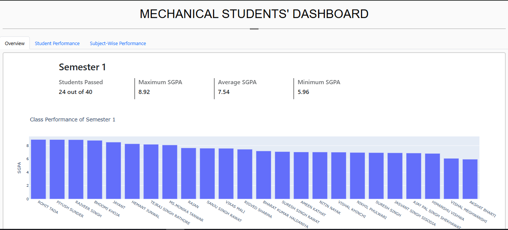

# 📊 Mechanical Student Dashboard

An interactive analytics dashboard for monitoring and comparing student academic performance across semesters and subjects. Designed for Mechanical Engineering departments to easily track student SGPA trends and subject-wise performance insights.

🚀 **[Try the Live Flask App Here](https://mechanical-students-dashboard.onrender.com/)**

---

## 🚀 Features

- 📈 **Student-wise and Subject-wise SGPA Analytics**
- 📊 Semester-wise performance overview with pass counts, average, maximum, and minimum SGPA.
- 📑 Tab-based navigation for different performance views.
- 📉 Interactive visualizations built using **Plotly**.
- 📂 Backend powered by **Flask** and **MongoDB**.
- 💻 Clean, responsive UI styled with **Bootstrap**.

---

## 🛠️ Tech Stack

- **Python**
- **Flask**
- **Pandas**
- **MongoDB**
- **Plotly**
- **Bootstrap 5**

---

